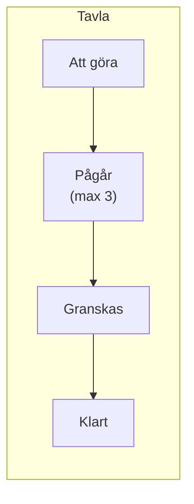

# Kanban

## Grundidén

Kanban är, till skillnad från Scrum, inte tidsboxat i sprintar. Istället visualiserar man arbetsflödet på en tavla med kolumner — och begränsar hur mycket som får vara i varje kolumn samtidigt.

En uppgift (ett **kort**) flyttas från vänster till höger allteftersom arbetet fortskrider. Ingen ny uppgift plockas in förrän det finns plats — det kallas **Work in Progress-gräns (WIP-gräns)**.

## Varför en WIP-gräns?

Utan en gräns på hur många uppgifter som får vara "Pågår" samtidigt, börjar folk på fler saker än de hinner slutföra — allt blir halvfärdigt samtidigt, ingenting blir klart. En WIP-gräns tvingar teamet att slutföra innan de börjar på nytt, vilket i praktiken gör att saker blir klara *snabbare* i genomsnitt, inte långsammare.

## Kanban vs Scrum

| | Scrum | Kanban |
|---|---|---|
| Tidsboxning | Ja — sprintar (1–4 veckor) | Nej — kontinuerligt flöde |
| Roller | Fasta (Scrum Master, Product Owner) | Inga fasta roller krävs |
| Planering | Sprint Planning i förväg | Uppgifter läggs till löpande |
| Passar bra för | Produktutveckling i cykler | Support, drift, löpande underhåll |

Många team blandar de två — sprintar från Scrum, tavlan och WIP-gränser från Kanban. Det finns inget krav på att välja exakt en metod rakt av.

## Mätvärden i Kanban

Eftersom Kanban inte har sprintar mäter man istället flödet direkt:

- **Cykeltid** — hur lång tid en uppgift tar från att den påbörjas till att den är klar
- **Genomloppstid (lead time)** — hur lång tid en uppgift tar från att den skapas till att den är klar (inkluderar väntetiden innan den påbörjas)

Ett team som ser cykeltiden växa vet att något i flödet har blivit en flaskhals — ofta syns det som en kolumn där korten hopar sig.
