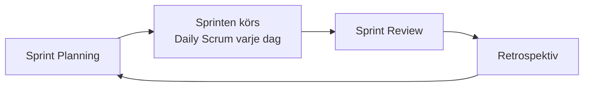

# Scrum

## Problemet Scrum löser

Ett traditionellt projekt planeras i förväg — hela vägen till leverans. Problemet: kraven ändras, kunden vet inte exakt vad de vill ha förrän de ser något, och ett sex månader långt plan som visar sig fel efter vecka två är dyrt att rätta till.

Scrum löser det genom att dela upp arbetet i korta, upprepade cykler — **sprintar** — där teamet planerar, bygger, testar och visar upp resultat, om och om igen. Fel upptäcks efter en till fyra veckor, inte efter sex månader.

## Sprinten

En **sprint** är en tidsboxad arbetsperiod, oftast 1–4 veckor. I slutet av varje sprint ska teamet ha levererat något **potentiellt leveransklart** — inte en halvfärdig funktion, utan något som faktiskt fungerar.

Cykeln upprepas sprint efter sprint tills produkten är klar — eller tills man bestämmer att det som finns räcker.

## De tre rollerna

Scrum definierar exakt tre roller — inga fler, inga färre:

| Roll | Ansvar |
|------|--------|
| **Product Owner** | Äger backlogen, prioriterar vad som ska byggas näst utifrån affärsvärde och kundbehov |
| **Scrum Master** | Faciliterar processen, håller i ceremonier, undanröjer hinder för teamet — är inte en chef |
| **Utvecklingsteamet** | Bygger produkten, självorganiserande, bestämmer själva *hur* arbetet görs |

Se [Roller](roller.md) för en djupare genomgång av Product Owner och Scrum Master.

## De fyra ceremonierna

### Sprint Planning

I början av varje sprint bestämmer teamet vad som ska göras — vilka poster från backlogen som plockas in i **Sprint Backlog** för den kommande sprinten.

### Daily Scrum

Ett kort (~15 minuter) dagligt möte där varje teammedlem svarar på tre frågor: Vad gjorde jag igår? Vad gör jag idag? Finns det något som blockerar mig? Mötet är till för teamet — inte en statusrapport till en chef.

### Sprint Review

I slutet av sprinten visar teamet upp vad som byggts för intressenter (kund, ledning, andra team). Fokus ligger på **vad som fungerar**, inte på processen.

### Retrospektiv

Efter Sprint Review samlas teamet en sista gång för att reflektera över **hur** de jobbade — vad gick bra, vad kan bli bättre till nästa sprint. Skillnaden mot Sprint Review: Review handlar om produkten, Retrospektiv handlar om arbetssättet.

## Backlogen

**Produktbacklogen** är en prioriterad lista över allt som återstår att göra — funktioner, buggar, förbättringar. Den ägs och underhålls av Product Owner, och den är aldrig "klar" — den växer och omprioriteras löpande i takt med att teamet lär sig mer.

Se [Backlog och Sprint](../begrepp/backlog-och-sprint.md) för en djupare genomgång av backlog, sprint backlog och user stories.

## Varför inte bara jobba på utan struktur?

Utan sprintar och tydliga roller blir det lätt otydligt vem som bestämmer vad, vad "klart" betyder, och hur ofta man stämmer av med kunden. Scrums styrka är att den ger ett *förutsägbart rytm* — alla vet när nästa avstämning kommer, utan att behöva planera hela projektet i detalj från start.
