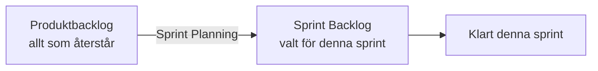

# Backlog och Sprint

## Produktbacklog

En prioriterad lista över **allt** som återstår att göra i ett projekt — nya funktioner, buggar, tekniska förbättringar. Den ägs av Product Owner och är aldrig "klar": den växer och omprioriteras kontinuerligt i takt med att teamet och kunden lär sig mer.

Varje post i backlogen är ofta skriven som en **user story** — se [User story och MVP](user-story-och-mvp.md).

## Sprint Backlog

När en sprint börjar plockar teamet ut ett antal poster från produktbacklogen — de som ska hinnas med under just den sprinten. Den listan kallas **Sprint Backlog** och låses för sprintens längd; nya krav som dyker upp under sprinten går till produktbacklogen och tas i nästa sprint, inte in i den pågående.

## Daily Scrum

Ett kort dagligt möte (~15 minuter) där teamet synkroniserar sig kring Sprint Backlog: vad gjordes igår, vad görs idag, och finns det något som blockerar arbetet. Mötet är för teamet, inte en statusrapport uppåt.

## Varför låsa Sprint Backlog?

Om nya krav ständigt får plockas in mitt i sprinten blir det omöjligt att veta vad som faktiskt kommer levereras vid sprintens slut — teamet jagar ett rörligt mål. Genom att låsa sprint backlog vet alla exakt vad som ska hinnas med, och nya idéer får vänta till nästa planering istället för att störa den pågående.
