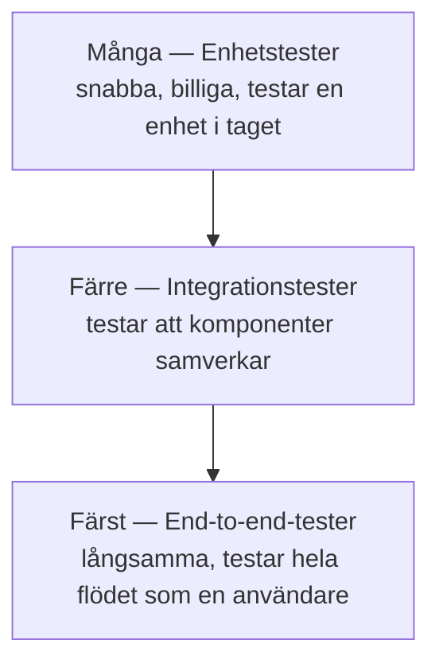

# Test-pyramiden

## Grundidén

En modell för hur testerna i ett projekt bör fördelas mellan olika nivåer — flest tester längst ner, färst längst upp.

## Varför en pyramid och inte en jämn fördelning?

| Nivå | Hastighet | Kostnad att underhålla | Vad den fångar |
|------|-----------|------------------------|-----------------|
| Enhetstest | Millisekunder | Låg | Logikfel i en enskild funktion/klass |
| Integrationstest | Sekunder | Medel | Fel i hur komponenter samverkar (databas, API) |
| End-to-end-test | Minuter | Hög | Fel i hela användarflödet, men trögt och skört |

End-to-end-tester är värdefulla — de testar det användaren faktiskt upplever — men de är långsamma att köra och lätta att göra skira (ett litet UI-ändring kan krascha ett test som inte har med logiken att göra). Bygger man för många av dem blir testsviten trög och opålitlig.

## Den omvända pyramiden — ett varningstecken

Ett team som mest skriver end-to-end-tester och få enhetstester har byggt en **omvänd pyramid** (eller "test-glass"). Symptomen: testsviten tar för lång tid att köra, testerna failar av orsaker som inte har med den faktiska buggen att göra, och ingen litar längre på resultatet.

## Kopplingen till agilt arbete

I ett team som levererar varje sprint (se [Scrum](../agilt/scrum.md)) måste testsviten kunna köras snabbt och pålitligt, ofta flera gånger om dagen i en CI/CD-pipeline. En sund test-pyramid är en förutsättning för att korta leveranscykler faktiskt ska fungera i praktiken — utan den blir varje sprint bromsad av en långsam, skör testkörning.
