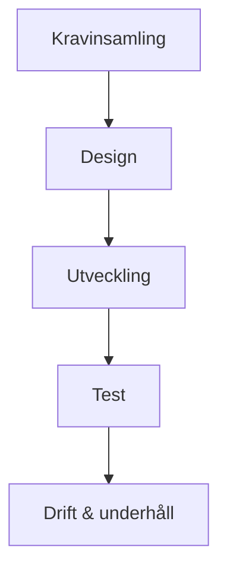

# Vattenfallsmodellen (Waterfall)

## Grundidén

Projektet delas in i sekventiella faser. Varje fas slutförs helt — med godkännande — innan nästa påbörjas. Det finns ingen återgång utan att formellt backa ett steg.

Namnet kommer från bilden: som ett vattenfall rinner arbetet bara nedåt, ett steg i taget — det rinner inte uppåt igen.

## Faserna

| Fas | Vad som händer |
|-----|----------------|
| Kravinsamling | Alla krav dokumenteras i detalj innan något byggs |
| Design | Hela systemets arkitektur och gränssnitt specificeras |
| Utveckling | Koden skrivs enligt designen |
| Test | Hela systemet testas mot de ursprungliga kraven |
| Drift & underhåll | Systemet levereras och driftsätts |

## Styrkor

- **Förutsägbart** — tydlig tidsplan och budget kan sättas i förväg, vilket många upphandlingar (särskilt offentliga) kräver
- **Tydlig dokumentation** — varje fas producerar dokument som nästa fas bygger vidare på
- **Passar när kraven verkligen är fasta** — t.ex. i vissa reglerade branscher (flygsäkerhet, medicinteknik) där kraven inte förväntas ändras

## Svagheter

- **Fel upptäcks sent** — om ett krav var fel, syns det inte förrän testfasen, långt efter att designen redan är byggd på det felaktiga antagandet
- **Kunden ser inget förrän slutet** — ingen fungerande produkt att ge feedback på förrän hela utvecklingsfasen är klar
- **Svårt att hantera förändring** — ett ändrat krav mitt i projektet kan kräva att man går tillbaka flera faser

## Varför agilt uppstod som en reaktion

Vattenfallsmodellens största problem i mjukvaruprojekt är att **krav nästan alltid ändras** under projektets gång — kunden förstår vad de egentligen vill ha först när de ser något fungera. Agila metoder (se [Agilt & Scrum](../agilt/index.md)) löser det genom att leverera något testbart var eller varannan vecka istället för en gång i slutet.

Vattenfall är inte "fel" — det är rätt verktyg när kraven verkligen är stabila och regelverket kräver detaljerad dokumentation i förväg. Problemet uppstår när man använder vattenfall för projekt där kraven i praktiken *inte* är stabila.
